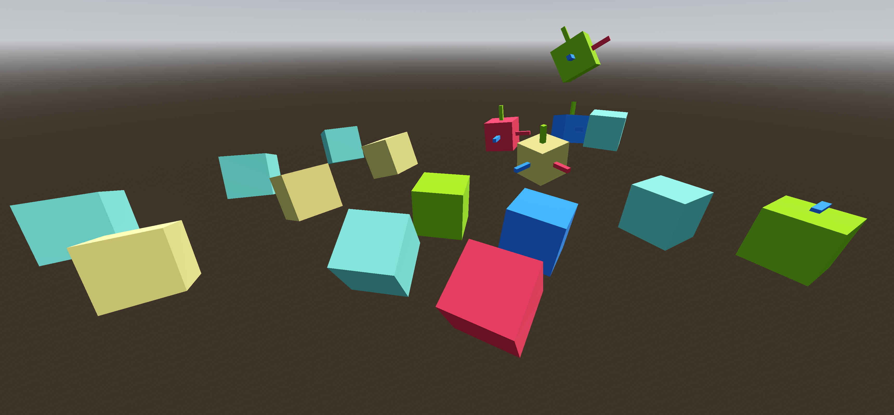

# VRMC_node_constraint Minimal Example

## Screenshot

## Description

This model is a minimal example of the
[VRMC_node_constraint](../../specification/VRMC_node_constraint-1.0/) extension.
It has several test cases of the aim, roll, and rotation constraints.
This model only contains plain nodes, not any skeletons or bones.

This does not include any other parts of the VRM specification,
it is only a test of this one glTF extension in isolation.
This is useful for testing a small part of VRM before implementing the
whole spec, and useful for having node constraints outside of VRM.

The `.glb` contains the same data as the `.gltf` + `.bin`, but in GLB format.

## License Information

[VRM Public License 1.0](https://vrm.dev/licenses/1.0/)
