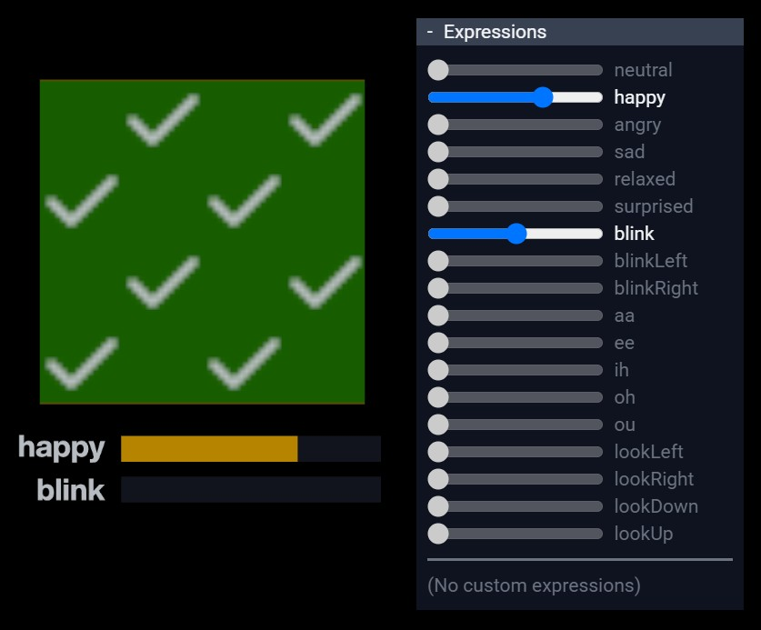

# VRMC_vrm expressions isBinary Overridden Test

## Screenshot



## Description

This model is an example of the [VRMC_vrm](../../specification/VRMC_vrm-1.0/) extension.

When an expression with isBinary is overridden by other expressions, the expression must be completely suppressed if the effect received is greater than 0.0, [as the specification says](https://github.com/vrm-c/vrm-specification/blob/master/specification/VRMC_vrm-1.0/expressions.md#interaction-between-override-and-isbinary).
This model tests if the overridden expression with isBinary `blink` is successfully suppressed by the overriding expression `happy` when the value of `happy` is greater than 0.0.

The big green plane with several check marks indicates that the expression values are within the expected range.
If cross marks are displayed or red regions are visible, it indicates that the implementation of the expressions is incorrect.

There also are yellow bars below the big plane that indicate the output value of the expressions.

The expressions of this model are defined as follows:

```json
"expressions": {
    "preset": {
        "happy": {
            "overrideBlink": "blend",
            "textureTransformBinds": [ ... ]
        },
        "blink": {
            "isBinary": true,
            "textureTransformBinds": [ ... ]
        }
    }
}
```

## License Information

[VRM Public License 1.0](https://vrm.dev/licenses/1.0/)

(c) 2025 pixiv Inc.
