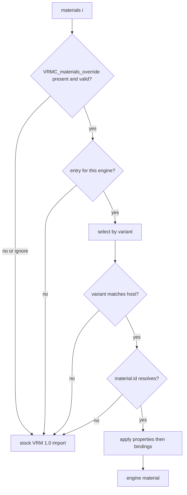
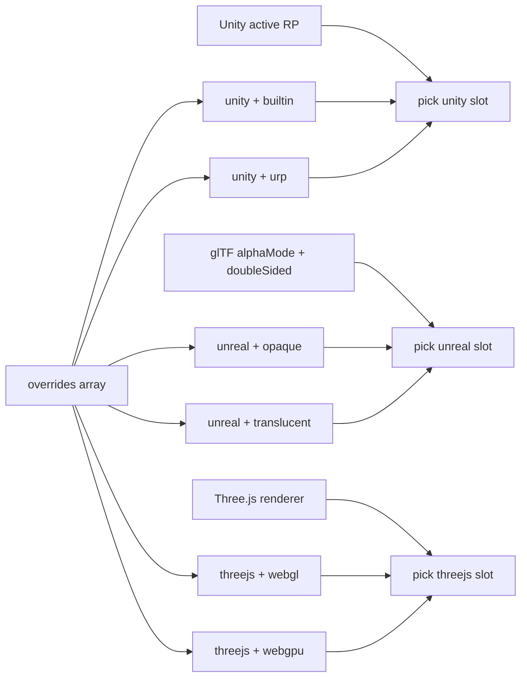

# VRMC_materials_override-1.0

*Version 1.0*


<!-- START doctoc generated TOC please keep comment here to allow auto update -->
<!-- DON'T EDIT THIS SECTION, INSTEAD RE-RUN doctoc TO UPDATE -->

- [Contributors](#contributors)
- [Status](#status)
- [Dependencies](#dependencies)
- [Overview](#overview)
- [Extending Materials](#extending-materials)
- [Exporter Implementation](#exporter-implementation)
  - [Fallback](#fallback)
- [VRMC_materials_override](#vrmc_materials_override)
  - [Properties](#properties)
  - [JSON Schema](#json-schema)
  - [VRMC_materials_override.specVersion ✅](#vrmc_materials_overridespecversion-)
  - [VRMC_materials_override.overrides](#vrmc_materials_overrideoverrides)
- [Override](#override)
  - [Properties](#properties-1)
  - [JSON Schema](#json-schema-1)
  - [Override.engine](#overrideengine)
  - [Override.material](#overridematerial)
  - [Override.bindings](#overridebindings)
  - [Override.properties](#overrideproperties)
  - [Selection key](#selection-key)
- [Material](#material)
  - [Properties](#properties-2)
  - [JSON Schema](#json-schema-2)
  - [Material.idType](#materialidtype)
  - [Material.id](#materialid)
  - [Material.variant](#materialvariant)
  - [Material.provider](#materialprovider)
- [Provider](#provider)
  - [Properties](#properties-3)
  - [JSON Schema](#json-schema-3)
  - [Provider.id](#providerid)
  - [Provider.version](#providerversion)
- [Binding](#binding)
  - [Properties](#properties-4)
  - [JSON Schema](#json-schema-4)
  - [Binding.source](#bindingsource)
  - [Binding.target](#bindingtarget)
  - [Binding.targetType](#bindingtargettype)
- [Property](#property)
  - [Properties](#properties-5)
  - [JSON Schema](#json-schema-5)
  - [Property.name](#propertyname)
  - [Property.type](#propertytype)
  - [Property.value](#propertyvalue)
  - [Property.texture](#propertytexture)
- [Example engines](#example-engines)
  - [unity](#unity)
  - [unreal](#unreal)
  - [threejs](#threejs)
- [Appendix: Application](#appendix-application)
  - [Resolve and apply](#resolve-and-apply)
    - [Load gate](#load-gate)
    - [Selection](#selection)
  - [Supported capabilities](#supported-capabilities)

<!-- END doctoc generated TOC please keep comment here to allow auto update -->

## Contributors

- TBD

## Status

Draft

## Dependencies

Written against the glTF 2.0 spec.

This specification targets VRM 1.0 (`VRMC_vrm` 1.0).

`bindings` depend on [`VRMC_materials_mtoon`](https://github.com/vrm-c/vrm-specification/blob/master/specification/VRMC_materials_mtoon-1.0/README.md) on the same material. An override MAY omit `bindings` and still be valid.

## Overview

`VRMC_materials_override` is a glTF extension on a material. It names an optional engine-specific material (shader, parent material, or equivalent) and MAY copy MToon shade values onto that material or set literal parameter values.

Implementations that do not support this extension MUST ignore it. They MUST import the material using remaining glTF and VRM 1.0 material rules (`VRMC_materials_mtoon`, `KHR_materials_unlit`, core PBR, in that existing precedence).

The file MUST NOT embed engine shader or material programs. A supporting implementation resolves `material.id` from assets it ships or that the host already provides.

## Extending Materials

The override is attached to a glTF `materials[]` entry.

```json
{
  "extensionsUsed": [
    "VRMC_vrm",
    "VRMC_materials_mtoon",
    "VRMC_materials_override"
  ],
  "materials": [
    {
      "name": "Face",
      "pbrMetallicRoughness": {
        "baseColorFactor": [1.0, 1.0, 1.0, 1.0]
      },
      "extensions": {
        "VRMC_materials_mtoon": {
          "specVersion": "1.0"
        },
        "VRMC_materials_override": {
          "specVersion": "1.0",
          "overrides": [
            {
              "engine": "unity",
              "material": {
                "idType": "shaderName",
                "id": "Example/SkinToon",
                "variant": "urp"
              },
              "properties": [
                {
                  "name": "_Color",
                  "type": "vector",
                  "value": [0.0, 1.0, 0.0, 1.0]
                }
              ]
            }
          ]
        }
      }
    }
  ]
}
```

When a supporting implementation **applies** an override (engine selected, `material` resolved, required assets present), it MUST use that override for the material. It MUST NOT fail the whole avatar load when an override cannot be applied.

When the override is absent, is for another engine, or fails to resolve, the implementation MUST keep stock VRM 1.0 material import for that material.

Files MUST NOT list `VRMC_materials_override` in `extensionsRequired`.

Unrecognized properties on the extension object MUST be ignored. The skippable unit is this material's `VRMC_materials_override` object. Invalid data there MUST NOT make the glTF or VRM 1.0 asset invalid.

This extension MUST NOT duplicate `VRMC_materials_mtoon` fields. Shade color, shading shift, shading toony, rim, matcap, outline width, UV animation, and related stock MToon properties stay in the sibling. Use `bindings` to transfer those values to engine parameters. Use `properties` for literals that do not come from MToon.

Validity of a file that uses this extension MUST NOT depend on membership of any `material` identifier in a closed registry or allowlist.

## Exporter Implementation

> *This section is non-normative.*

### Fallback

Export the portable material as usual (core glTF fields and `VRMC_materials_mtoon` when the material is MToon). Then add `VRMC_materials_override`. Implementations that ignore the extension keep the portable material.

Do not put `VRMC_materials_override` in `extensionsRequired`.

When emitting `properties[].texture`, register the image through the normal glTF texture export path so the index resolves in the output file.

## VRMC_materials_override

The root object of this extension.

### Properties

||Type|Description|Required|
|:-|:-|:-|:-|
|`specVersion`|`string`|The version of this extension|✅ Yes|
|`overrides`|`Override[]`|Non-empty list of engine-specific overrides|✅ Yes|

### JSON Schema

[VRMC_materials_override.schema.json](schema/VRMC_materials_override.schema.json)

#### VRMC_materials_override.specVersion ✅

Specification version of `VRMC_materials_override`.
The value MUST be `"1.0"`.

- Type: `string`
- Required: Yes

#### VRMC_materials_override.overrides

Engine-specific override entries. The array MUST contain at least one entry.

A supporting implementation MUST select at most one override for its `engine` string. It MUST ignore entries whose `engine` it does not recognize.

- Type: [Override](#override) array
- Required: Yes
- Minimum items: 1

## Override

One engine-specific override for the parent glTF material.

### Properties

||Type|Description|Required|
|:-|:-|:-|:-|
|`engine`|`string`|Case-sensitive engine identifier|✅ Yes|
|`material`|[Material](#material)|Engine-specific material definition|✅ Yes|
|`bindings`|[Binding](#binding) `[]`|MToon semantic-to-target bindings|No|
|`properties`|[Property](#property) `[]`|Literal engine parameter values|No|

### JSON Schema

[VRMC_materials_override.override.schema.json](schema/VRMC_materials_override.override.schema.json)

#### Override.engine

Case-sensitive identifier for the target runtime. This field is an open string, not an enum. This document describes `unity`, `unreal`, and `threejs` as examples. Other values are valid. A supporting implementation MUST ignore `engine` values it does not recognize.

- Type: `string`
- Required: Yes

#### Override.material

Engine-specific identity. A supporting implementation MUST ignore a material definition it does not recognize. If the definition or any required asset cannot be resolved, it MUST use stock VRM 1.0 material import for that material.

- Type: [Material](#material)
- Required: Yes

#### Override.bindings

Each entry maps one MToon source semantic to one engine parameter.

A supporting implementation MUST resolve source values from the sibling `VRMC_materials_mtoon` extension. When a source property is omitted on that sibling, it MUST use the default defined by the supported `VRMC_materials_mtoon` version.

It MUST ignore a binding when the material has no `VRMC_materials_mtoon` extension or does not recognize the binding's `source` semantic. It MUST ignore incompatible source/target combinations.

Color-vector conversion, texture-coordinate handling, and shader-feature rebuild behavior are implementation-defined until specified.

- Type: [Binding](#binding) array
- Required: No

#### Override.properties

Literal values on engine parameters, independent of `VRMC_materials_mtoon`. `properties` MAY be omitted or empty. A material MAY use `bindings`, `properties`, both, or neither.

`properties[].name` MUST NOT equal any `bindings[].target` in the same override. Exporters MUST omit a `properties` entry for a target already covered by a `bindings` entry. A supporting implementation MUST still apply `properties` before `bindings` and let `bindings` win on conflict.

A supporting implementation MUST ignore a `properties` entry with an unrecognized `type` or a value it cannot resolve, including an out-of-range `texture` index. It MUST NOT fail import of the material for that reason.

`properties[].value` MUST be literal data stored in the file. `properties` MUST NOT reference, duplicate, or replace `VRMC_materials_mtoon` fields.

- Type: [Property](#property) array
- Required: No

### Selection key

A material MUST NOT contain more than one override with the same **selection key**.

The default selection key is `engine` alone. An implementation MAY refine the key with `material.variant` (the `unity` and `unreal` examples do this). When a refined key is used, that key MUST be unique among entries that share the same `engine`.

## Material

Engine-specific identity for the override material.

### Properties

||Type|Description|Required|
|:-|:-|:-|:-|
|`idType`|`string`|Identity scheme|✅ Yes|
|`id`|`string`|Identity string for `idType`|✅ Yes|
|`variant`|`string`|Selection-key refinement|No|
|`provider`|[Provider](#provider)|Advisory package or plugin hint|No|

### JSON Schema

[VRMC_materials_override.material.schema.json](schema/VRMC_materials_override.material.schema.json)

#### Material.idType

Identity scheme. Open string. Examples: `shaderName` (`unity`), `resourcePath` (`unreal`), `constructorName` (`threejs`). Other values are valid. A supporting implementation MUST ignore an `idType` it does not recognize.

- Type: `string`
- Required: Yes

#### Material.id

Identity string interpreted according to `idType`.

- Type: `string`
- Required: Yes

#### Material.variant

Refines the selection key when more than one override shares the same `engine`. Open string. Example values for `unity`, `unreal`, and `threejs` are under [Example engines](#example-engines).

- Type: `string`
- Required: No

#### Material.provider

Advisory. A consumer MAY warn on package or plugin mismatch. It MUST NOT treat a missing or mismatched `provider` as grounds to reject the file.

- Type: [Provider](#provider)
- Required: No

## Provider

### Properties

||Type|Description|Required|
|:-|:-|:-|:-|
|`id`|`string`|Package or plugin identifier|✅ Yes|
|`version`|`string`|Exporter-observed version|No|

### JSON Schema

[VRMC_materials_override.provider.schema.json](schema/VRMC_materials_override.provider.schema.json)

#### Provider.id

Unity package name, Unreal plugin name, npm package name, or an equivalent identifier for the engine.

- Type: `string`
- Required: Yes

#### Provider.version

Version observed at export time.

- Type: `string`
- Required: No

## Binding

Maps one `VRMC_materials_mtoon` source semantic to one engine material parameter.

### Properties

||Type|Description|Required|
|:-|:-|:-|:-|
|`source`|`string`|MToon source semantic|✅ Yes|
|`target`|`string`|Engine parameter identifier|✅ Yes|
|`targetType`|`string`|`scalar`, `vector`, `texture`, or `shaderFeature`|✅ Yes|

### JSON Schema

[VRMC_materials_override.binding.schema.json](schema/VRMC_materials_override.binding.schema.json)

#### Binding.source

The following identifiers refer to resolved values from `VRMC_materials_mtoon`. They do not name engine material parameters.

|Source|Value|
|:-|:-|
|`shadeColorFactor`|RGB shade color factor|
|`shadeMultiplyTexture`|Shade multiply texture and its texture-info metadata|
|`shadingShiftFactor`|Base shading shift scalar|
|`shadingShiftTexture`|Shading shift texture and its texture-info metadata|
|`shadingShiftTexture.scale`|Scalar applied to the shading shift texture|
|`shadingToonyFactor`|Shading boundary toony scalar|
|`giEqualizationFactor`|Global illumination equalization scalar|

- Type: `string`
- Required: Yes

#### Binding.target

Engine-specific material parameter identifier.

- Type: `string`
- Required: Yes

#### Binding.targetType

How the resolved source is written to the target.

- Type: `string`
- Required: Yes
- Values: `scalar`, `vector`, `texture`, `shaderFeature`

## Property

Literal value for one engine material parameter.

`scalar` and `vector` store numeric data in `value`. `texture` stores an index into the file's glTF `textures[]` in `texture`, and MAY store Unity tiling/offset in `value` as `[scale.x, scale.y, offset.x, offset.y]`. Omit `value` for `texture` when tiling/offset is identity `(1, 1, 0, 0)`.

`shaderFeature` is a boolean toggle for a discrete shader capability: a Unity shader keyword driven by `#pragma shader_feature`, an Unreal Material Static Switch, or a ShaderLab `[Toggle]`-backed keyword.

### Properties

||Type|Description|Required|
|:-|:-|:-|:-|
|`name`|`string`|Engine parameter identifier|✅ Yes|
|`type`|`string`|`scalar`, `vector`, `texture`, or `shaderFeature`|✅ Yes|
|`value`|`number`, `number[]`, or `boolean`|Literal value matching `type`. Optional for `texture`|Required unless `type` is `texture`|
|`texture`|`integer`|Index into glTF `textures[]`|Required when `type` is `texture`|

### JSON Schema

[VRMC_materials_override.property.schema.json](schema/VRMC_materials_override.property.schema.json)

#### Property.name

Engine-specific material parameter identifier.

- Type: `string`
- Required: Yes

#### Property.type

- Type: `string`
- Required: Yes
- Values: `scalar`, `vector`, `texture`, `shaderFeature`

#### Property.value

Literal value matching `type`.

- Type: `number` (`scalar`), `number[]` (`vector` or optional `texture` ST), or `boolean` (`shaderFeature`)
- Required: Yes, except when `type` is `texture`

#### Property.texture

Index into glTF `textures[]`.

- Type: `integer` (glTF id)
- Required: when `type` is `texture`

## Example engines

> *This section is non-normative.*

`engine`, `material.idType`, and `material.variant` are open strings. The following hosts are examples. A file MAY use other `engine` values. New engines do not require a change to this extension's `specVersion`. Implementations that do not recognize an `engine` ignore those entries.

### unity

The consumer considers all `overrides[]` where `engine` equals `unity`.

|Property|Type|Required|Meaning|
|:-|:-|:-|:-|
|`material.idType`|`string`|Yes|MUST be `shaderName`|
|`material.id`|`string`|Yes|Exact Unity shader name (`Shader.Find`)|
|`material.variant`|`string`|See selection|`builtin`, `urp`, or `hdrp`|
|`material.provider.id`|`string`|If `provider` present|Unity package name|
|`material.provider.version`|`string`|No|Exporter-observed package version|

|`variant`|Unity pipeline|
|:-|:-|
|`builtin`|Built-in Render Pipeline|
|`urp`|Universal Render Pipeline|
|`hdrp`|High Definition Render Pipeline|

Selection:

- One `unity` entry: `material.variant` MAY be omitted or empty. That entry matches any active pipeline.
- Two or more `unity` entries: each MUST have a non-empty `material.variant` of `builtin`, `urp`, or `hdrp`. Duplicate `(unity, variant)` pairs are invalid.
- Prefer the entry whose `variant` equals the active pipeline. Else, if exactly one `unity` entry has omitted or empty `variant`, use that. Else use stock import for that material.

```json
{
  "engine": "unity",
  "material": {
    "idType": "shaderName",
    "id": "Example/SkinToon",
    "variant": "urp",
    "provider": {
      "id": "com.example.materials",
      "version": "1.2.0"
    }
  },
  "bindings": [
    {
      "source": "shadeColorFactor",
      "target": "_ShadeColor",
      "targetType": "vector"
    },
    {
      "source": "shadeMultiplyTexture",
      "target": "_ShadeTex",
      "targetType": "texture"
    },
    {
      "source": "shadingShiftFactor",
      "target": "_ShadingShiftFactor",
      "targetType": "scalar"
    },
    {
      "source": "shadingToonyFactor",
      "target": "_ShadingToonyFactor",
      "targetType": "scalar"
    }
  ],
  "properties": [
    {
      "name": "_UseRimLight",
      "type": "shaderFeature",
      "value": true
    }
  ]
}
```

### unreal

The consumer considers all `overrides[]` where `engine` equals `unreal`.

|Property|Type|Required|Meaning|
|:-|:-|:-|:-|
|`material.idType`|`string`|Yes|MUST be `resourcePath`|
|`material.id`|`string`|Yes|Engine resource path to a parent material|
|`material.variant`|`string`|See selection|`opaque`, `opaqueTwoSided`, `translucent`, or `translucentTwoSided`|
|`material.provider.id`|`string`|If `provider` present|Unreal plugin name|
|`material.provider.version`|`string`|No|Exporter-observed plugin version|

Selection:

- One `unreal` entry: `material.variant` MAY be omitted or empty. That entry matches any blend/cull combination derived from the glTF material.
- Two or more `unreal` entries: each MUST have a non-empty `material.variant` from the table. Duplicate `(unreal, variant)` pairs are invalid.
- Otherwise pick the entry whose `variant` matches core glTF material state:

|`alphaMode`|`doubleSided`|Select `variant`|
|:-|:-|:-|
|`OPAQUE`|`false`|`opaque`|
|`OPAQUE`|`true`|`opaqueTwoSided`|
|`MASK`|`false`|`opaque`|
|`MASK`|`true`|`opaqueTwoSided`|
|`BLEND`|`false`|`translucent`|
|`BLEND`|`true`|`translucentTwoSided`|

If no entry matches, or `id` does not resolve, use stock VRM 1.0 / host material import for that material.

```json
{
  "engine": "unreal",
  "material": {
    "idType": "resourcePath",
    "id": "/ExampleMaterials/Materials/M_Skin_Opaque.M_Skin_Opaque",
    "variant": "opaque",
    "provider": {
      "id": "ExampleMaterials",
      "version": "1.0.0"
    }
  }
}
```

### threejs

The consumer considers all `overrides[]` where `engine` equals `threejs`. Typical VRM hosts on this engine use [@pixiv/three-vrm](https://github.com/pixiv/three-vrm) (`VRMLoaderPlugin` on Three.js `GLTFLoader`).

|Property|Type|Required|Meaning|
|:-|:-|:-|:-|
|`material.idType`|`string`|Yes|This example uses `constructorName`|
|`material.id`|`string`|Yes|JavaScript constructor name the app can resolve (for example `MToonMaterial`)|
|`material.variant`|`string`|See selection|`webgl` or `webgpu`|
|`material.provider.id`|`string`|If `provider` present|npm package name|
|`material.provider.version`|`string`|No|Exporter-observed package version|

|`variant`|Three.js renderer|
|:-|:-|
|`webgl`|`WebGLRenderer` (three-vrm `MToonMaterial`)|
|`webgpu`|`WebGPURenderer` (three-vrm `MToonNodeMaterial`)|

Selection:

- One `threejs` entry: `material.variant` MAY be omitted or empty. That entry matches any renderer.
- Two or more `threejs` entries: each MUST have a non-empty `material.variant` of `webgl` or `webgpu`. Duplicate `(threejs, variant)` pairs are invalid.
- Prefer the entry whose `variant` matches the active renderer. Else, if exactly one `threejs` entry has omitted or empty `variant`, use that. Else use stock import for that material.

```json
{
  "engine": "threejs",
  "material": {
    "idType": "constructorName",
    "id": "MToonMaterial",
    "variant": "webgl",
    "provider": {
      "id": "@pixiv/three-vrm",
      "version": "3.0.0"
    }
  },
  "bindings": [
    {
      "source": "shadeColorFactor",
      "target": "shadeColorFactor",
      "targetType": "vector"
    }
  ]
}
```

## Appendix: Application

> The following information is non-normative.

### Resolve and apply

1. Read `materials[i].extensions.VRMC_materials_override`.
2. Select at most one override for this `engine` (see [Example engines](#example-engines)).
3. Resolve `material.id` using `idType`.
4. Apply `properties`, then `bindings` (bindings win on the same target).
5. If any required step fails, keep stock import for that material.

Unresolved `properties[]` entries skip that entry only. Failed `material.id` resolve uses stock import for the material.

#### Load gate



Stock import follows remaining glTF and VRM 1.0 material rules (`VRMC_materials_mtoon`, `KHR_materials_unlit`, core PBR, in that existing precedence).

#### Selection

Sibling `overrides[]` entries MAY share an `engine` when that host refines the selection key with `material.variant`. Each consumer picks at most one slot for each `engine` string it implements. Other engines may appear in the same array; ignore them.



| Example `engine` | How the consumer picks the slot |
|---------|----------------------------------|
| `unity` | Active host render pipeline (`builtin` / `urp` / `hdrp`) |
| `unreal` | This glTF material's `alphaMode` + `doubleSided` |
| `threejs` | Active renderer (`webgl` / `webgpu`); typical host `@pixiv/three-vrm` |

Optional catalogs MAY help authors discover shader names and parameter identifiers. Catalog absence is not an error.

`KHR_materials_variants` swaps primitive material indices. It does not carry engine material identities or MToon bindings.

### Supported capabilities

A supporting implementation that presents a shader or a discrete shader capability (including a `shaderFeature` / keyword) as supported SHOULD ensure that capability works using host engine APIs available to that consumer and shaders, materials, and packages that consumer ships.

Files MAY still emit `properties`, `bindings`, or `shaderFeature` entries that name host-dependent capabilities. Supporting implementations ignore unresolvable entries and keep stock import when required assets are missing. They MUST NOT require those third-party stacks to load the file.
