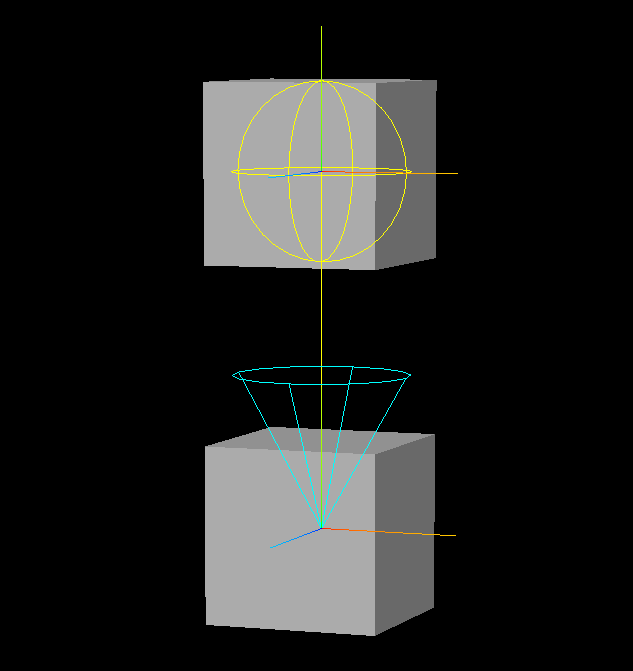
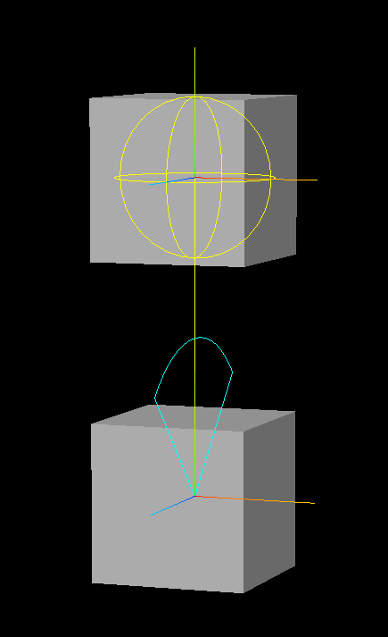
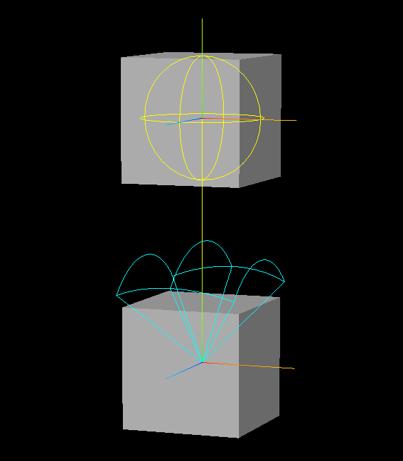
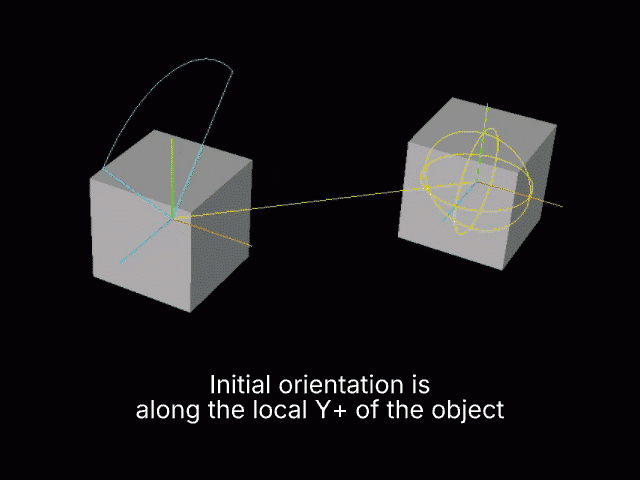

# VRMC_springBone_limit-1.0

*Version 1.0-draft*

<!-- START doctoc generated TOC please keep comment here to allow auto update -->
<!-- DON'T EDIT THIS SECTION, INSTEAD RE-RUN doctoc TO UPDATE -->

- [Contributors](#contributors)
- [Status](#status)
- [Dependencies](#dependencies)
- [Overview](#overview)
  - [Limits](#limits)
    - [Cone Limit](#cone-limit)
    - [Hinge Limit](#hinge-limit)
    - [Spherical Limit](#spherical-limit)
  - [Limit Application Order](#limit-application-order)
- [glTF Schema Updates](#gltf-schema-updates)
  - [Extending Springs](#extending-springs)
  - [VRMC_springBone_limit](#vrmc_springbone_limit)
    - [Properties](#properties)
    - [JSON Schema](#json-schema)
    - [VRMC_springBone_limit.specVersion ✅](#vrmc_springbone_limitspecversion-)
    - [VRMC_springBone_limit.limit ✅](#vrmc_springbone_limitlimit-)
  - [Limit](#limit)
    - [Properties](#properties-1)
    - [JSON Schema](#json-schema-1)
    - [Limit.cone](#limitcone)
    - [Limit.hinge](#limithinge)
    - [Limit.spherical](#limitspherical)
  - [ConeLimit](#conelimit)
    - [Properties](#properties-2)
    - [JSON Schema](#json-schema-2)
    - [ConeLimit.angle ✅](#conelimitangle-)
    - [ConeLimit.rotation](#conelimitrotation)
  - [HingeLimit](#hingelimit)
    - [Properties](#properties-3)
    - [JSON Schema](#json-schema-3)
    - [HingeLimit.angle ✅](#hingelimitangle-)
    - [HingeLimit.rotation](#hingelimitrotation)
  - [SphericalLimit](#sphericallimit)
    - [Properties](#properties-4)
    - [JSON Schema](#json-schema-4)
    - [SphericalLimit.phi ✅](#sphericallimitphi-)
    - [SphericalLimit.theta ✅](#sphericallimittheta-)
    - [SphericalLimit.rotation](#sphericallimitrotation)
- [Appendix: Reference Implementations](#appendix-reference-implementations)
  - [ConeLimit](#conelimit-1)
  - [HingeLimit](#hingelimit-1)
  - [SphericalLimit](#sphericallimit-1)

<!-- END doctoc generated TOC please keep comment here to allow auto update -->

## Contributors

- 0b5vr

## Status

Draft

## Dependencies

glTF 2.0仕様に向けて策定されています。

本仕様は [`VRMC_springBone`](https://github.com/vrm-c/vrm-specification/blob/master/specification/VRMC_springBone-1.0/README.ja.md) に依存します。

## Overview

`VRMC_springBone_limit` は、`VRMC_springBone` によって制御されるスプリングの移動範囲を制限するglTF拡張です。
本拡張は、コーンリミット・ヒンジリミット・球面リミットを定義します。

### Limits

本拡張によって定義されるリミットは、コーンリミット・ヒンジリミット・球面リミットの3種類です。

各リミットについて、参考実装を[Appendix: Reference Implementations](#appendix-reference-implementations)に示します。

#### Cone Limit

コーンリミットは、スプリングの移動範囲をコーン状に制限します。

コーンリミットは、コーンの広がりを表す角度・コーンの向きを表す回転で定義されます。

コーンリミットが定義されたスプリングは、HeadからTailに向かう方向を基準として、コーンの角度として指定した角度よりも傾くことがないように回転が制限されます。

リミットの回転を指定しない場合、コーンはHeadからTailに向かう方向に向かって広がるように定義されます。



#### Hinge Limit

ヒンジリミットは、スプリングの移動範囲をヒンジ状に制限します。

ヒンジリミットは、ヒンジの広がりを表す角度・ヒンジの向きを表す回転で定義されます。

ヒンジリミットが定義されたスプリングは、HeadからTailに向かう方向を基準として、ヒンジの角度として指定した角度よりも傾くことがないよう、またヒンジが定義した回転軸以外で回転することがないように回転が制限されます。

リミットの回転を指定しない場合、オブジェクトのy軸正方向に広がり、x軸周りの回転を許容するような形状を持つヒンジを、HeadからTailに向かう方向にヒンジが広がるよう最短経路で回転させた状態で定義します。



#### Spherical Limit

球面リミットは、スプリングの移動範囲を球面状に制限します。

球面リミットは、球面座標におけるPhi・Thetaの2つの角度・球面の向きを表す回転で定義されます。

球面リミットが定義されたスプリングは、HeadからTailに向かう方向を基準として、パラメータとして設定したPhi・Thetaを球面座標系における角度範囲として回転を制限します。

リミットの回転を指定しない場合、オブジェクトのy軸正方向を基準として、x軸周りの回転をPhi・z軸周りの回転をThetaとするような球面座標系を、HeadからTailに向かう方向が基準となるよう最短経路で回転させた状態で定義します。



### Rotation

各リミットは、 `rotation` プロパティを変更することでリミットの向きを変更できます。
各リミットは、オブジェクトのy軸正方向を基準として、各リミットの形状をHeadからTailに向かう方向が基準等なるよう最短経路で回転させた状態が初期回転となりますが、その状態のローカル座標系から `rotation` だけ回転させた状態が適用されます。



回転について、詳細な実装を[Appendix: Reference Implementations](#appendix-reference-implementations)に示します。

### Limit Application Order

リミットによる角度制限は、以下のすべてのタイミングで適用することが推奨されます（SHOULD）。

- 慣性計算の直後
- 各コライダーとの衝突が発生した場合、その直後

## glTF Schema Updates

### Extending Springs

リミットは、 `VRMC_springBone` で定義されたジョイントに `VRMC_springBone_limit` 拡張を追加することで記述されます。

```json
{
  "extensionsUsed": [
    "VRMC_springBone",
    "VRMC_springBone_limit"
  ],
  "extensions": {
    "VRMC_springBone": {
      "specVersion": "1.0",
      "springs": [
        {
          "joints": [
            {
              "node": 0,
              "hitRadius": 0.25,
              "stiffness": 1.0,
              "dragForce": 0.4,
              "extensions": {
                "VRMC_springBone_limit": {
                  "specVersion": "1.0-draft",
                  "limit": {
                    "cone": {
                      "angle": 0.785398,
                      "rotation": [ 0.0, 0.0, 0.0, 1.0 ]
                    }
                  }
                }
              }
            },
            // ...
          ]
        },
        // ...
      ],
      // ...
    }
  },
  // 通常のglTF 2.0の情報
  "nodes": [
    // ...
  ]
}
```

### VRMC_springBone_limit

本拡張のルートオブジェクトです。

{
  "$schema": "http://json-schema.org/draft-04/schema",
  "title": "VRMC_springBone_limit",
  "type": "object",
  "description": "An angle limit for VRMC_springBone.",
  "allOf": [ { "$ref": "glTFProperty.schema.json" } ],
  "properties": {
    "specVersion": {
      "type": "string",
      "description": "Specification version of VRMC_springBone_limit."
    },
    "limit": {
      "$ref": "VRMC_springBone_limit.limit.schema.json"
    },
    "extensions": { },
    "extras": { }
  },
  "required": [ "specVersion", "limit" ]
}


#### Properties

||型|説明|必須|
|:-|:-|:-|:-|
|`specVersion`|`string`|この拡張のバージョン|✅ Yes|
|`limit`|[Limit](#limit)|リミットの定義|✅ Yes|

#### JSON Schema

[VRMC_springBone_limit.schema.json](schema/VRMC_springBone_limit.schema.json)

#### VRMC_springBone_limit.specVersion ✅

`VRMC_springBone_limit` 拡張のバージョンを示します。値は `"1.0-draft"` でなければなりません。

- 型: `string`
- 必須: Yes

#### VRMC_springBone_limit.limit ✅

スプリングに適用するリミットを定義します。

- 型: [Limit](#limit)
- 必須: Yes

### Limit

スプリングに適用するリミットを定義します。

`cone` ・ `hinge` ・ `spherical` のうち、いずれか一つのみを含む必要があります。

#### Properties

||型|説明|必須|
|:-|:-|:-|:-|
|`cone`|[ConeLimit](#conelimit)|コーンリミット|No|
|`hinge`|[HingeLimit](#hingelimit)|ヒンジリミット|No|
|`spherical`|[SphericalLimit](#sphericallimit)|球面リミット|No|

#### JSON Schema

[VRMC_springBone_limit.limit.schema.json](schema/VRMC_springBone_limit.limit.schema.json)

#### Limit.cone

コーンリミットを定義します。

- 型: [ConeLimit](#conelimit)
- 必須: No

#### Limit.hinge

ヒンジリミットを定義します。

- 型: [HingeLimit](#hingelimit)
- 必須: No

#### Limit.spherical

球面リミットを定義します。

- 型: [SphericalLimit](#sphericallimit)
- 必須: No

### ConeLimit

コーンリミットを定義します。

#### Properties

||型|説明|必須|
|:-|:-|:-|:-|
|`angle`|`number`|コーンリミットの角度（度）|✅ Yes|
|`rotation`|`number[4]`|コーンリミットの相対回転|No|

#### JSON Schema

[VRMC_springBone_limit.cone.schema.json](schema/VRMC_springBone_limit.cone.schema.json)

#### ConeLimit.angle ✅

コーンリミットの角度を示します。角度は弧度法で表され、0以上でなければなりません。
角度がπ以上に設定された場合、角度は実装によってπとして解釈されます。
角度をπに設定したとき、コーンの形状は球と同等になります。

- 型: `number`
- 必須: Yes

#### ConeLimit.rotation

コーンリミットのデフォルトの向きからの相対回転を示します。
回転はクォータニオン（x, y, z, w）で表され、wがスカラー成分です。

- 型: `number[4]`
- 必須: No
- デフォルト: `[ 0.0, 0.0, 0.0, 1.0 ]`

### HingeLimit

ヒンジリミットを定義します。

#### Properties

||型|説明|必須|
|:-|:-|:-|:-|
|`angle`|`number`|ヒンジリミットの角度（度）|✅ Yes|
|`rotation`|`number[4]`|ヒンジリミットの相対回転|No|

#### JSON Schema

[VRMC_springBone_limit.hinge.schema.json](schema/VRMC_springBone_limit.hinge.schema.json)

#### HingeLimit.angle ✅

ヒンジリミットの角度を示します。角度は弧度法で表され、0以上でなければなりません。
角度がπ以上に設定された場合、角度は実装によってπとして解釈されます。
角度をπに設定したとき、ヒンジの形状は円盤と同等になります。

- 型: `number`
- 必須: Yes

#### HingeLimit.rotation

ヒンジリミットのデフォルトの向きからの相対回転を示します。
回転はクォータニオン（x, y, z, w）で表され、wがスカラー成分です。

- 型: `number[4]`
- 必須: No
- デフォルト: `[ 0.0, 0.0, 0.0, 1.0 ]`

### SphericalLimit

球面リミットを定義します。

#### Properties

||型|説明|必須|
|:-|:-|:-|:-|
|`phi`|`number`|球面リミットのPhi（度）|✅ Yes|
|`theta`|`number`|球面リミットのTheta（度）|✅ Yes|
|`rotation`|`number[4]`|球面リミットの相対回転|No|

#### JSON Schema

[VRMC_springBone_limit.spherical.schema.json](schema/VRMC_springBone_limit.spherical.schema.json)

#### SphericalLimit.phi ✅

球面リミットのPhi角度を示します。角度は弧度法で表され、0以上でなければなりません。
角度がπ以上に設定された場合、角度は実装によってπとして解釈されます。

- 型: `number`
- 必須: Yes

#### SphericalLimit.theta ✅

球面リミットのTheta角度を示します。角度は弧度法で表され、0以上でなければなりません。
角度がπ/2以上に設定された場合、角度は実装によってπ/2として解釈されます。

- 型: `number`
- 必須: Yes

#### SphericalLimit.rotation

球面リミットのデフォルトの向きからの相対回転を示します。
回転はクォータニオン（x, y, z, w）で表され、wがスカラー成分です。

- 型: `number[4]`
- 必須: No
- デフォルト: `[ 0.0, 0.0, 0.0, 1.0 ]`

## Appendix: Reference Implementations

> *以下の情報はNon-normativeです。*

以下に、本拡張で定義する各リミットの参考実装を示します。

以下の参考実装において `tailDir` は、制限するjointのワールド空間における方向を正規化された三次元ベクトルで表したものです。
SpringBoneの慣性計算およびコライダーとの衝突判定の過程で利用する `nextTail` を利用して、以下の擬似コードのように定義します。

```ts
var tailDir = (nextTail - joint.worldPosition).normalized;
```

### Rotation

以下に、各リミットをHeadからTailに向かう方向ならびに `rotation` プロパティを利用して回転させる参考実装を擬似コードで示します。

```ts
// Y+方向からjointのheadからtailに向かうベクトルへの最小回転
let axisRotation = fromToQuaternion(vec3(0, 1, 0), boneAxis);

// limitのローカル空間をワールド空間に写像する回転
let rotation = joint.parent.worldRotation * joint.localSpaceInitialRotation * axisRotation * joint.limit.rotation;

// tailの向きをlimitのローカル空間に写像する
tailDir = tailDir.applyQuaternion(rotation.inverse);

// limitを適用する
joint.limit.apply(tailDir);

// tailの向きをワールド空間に戻す
tailDir = tailDir.applyQuaternion(rotation);
```

### ConeLimit

以下は、擬似コードによるコーンリミットの参考実装です。

```ts
// tailDirのy要素をjointに設定されたangleの余弦と比較する
let cosAngle = cos(joint.angle);
if (tailDir.y < cosAngle) {
  // x・z要素を、tailDirの正弦とjointに設定されたangleの正弦の比を用いてスケールする
  let ratio = sqrt((1.0 - cosAngle * cosAngle) / (1.0 - tailDir.y * tailDir.y));
  tailDir.x *= ratio;
  tailDir.z *= ratio;

  // y要素を、jointに設定されたangleの余弦とする
  tailDir.y = cosAngle;
}
```

### HingeLimit

以下は、擬似コードによるヒンジリミットの参考実装です。

```ts
// x要素を0にし、正規化する
tailDir.x = 0.0;
tailDir = tailDir.normalized;

// tailDirのy要素をjointに設定されたangleの余弦と比較する
let cosAngle = cos(joint.angle);
if (tailDir.y < cosAngle) {
  // z要素を、tailDirの正弦とjointに設定されたangleの正弦の比を用いてスケールする
  let ratio = sqrt((1.0 - cosAngle * cosAngle) / (1.0 - tailDir.y * tailDir.y));
  tailDir.z *= ratio;

  // y要素を、jointに設定されたangleの余弦とする
  tailDir.y = cosAngle;
}
```

### SphericalLimit

以下は、擬似コードによる球面リミットの参考実装です。

```ts
// tailDirのphi・thetaを計算する
var phi = atan2(tailDir.z, tailDir.y);
var theta = asin(tailDir.x);

// phi・thetaをjointに設定されたphi・thetaを用いて制限する
if (abs(phi) > joint.phi) {
  isLimited = true;
  phi = joint.phi * sign(phi);
}

// thetaをjointに設定されたthetaを用いて制限する
if (abs(theta) > joint.theta) {
  isLimited = true;
  theta = joint.theta * sign(theta);
}

// tailDirをphi・thetaを用いて再計算する
tailDir = vec3(
  sin(theta),
  cos(theta) * cos(phi),
  cos(theta) * sin(phi)
);
```
