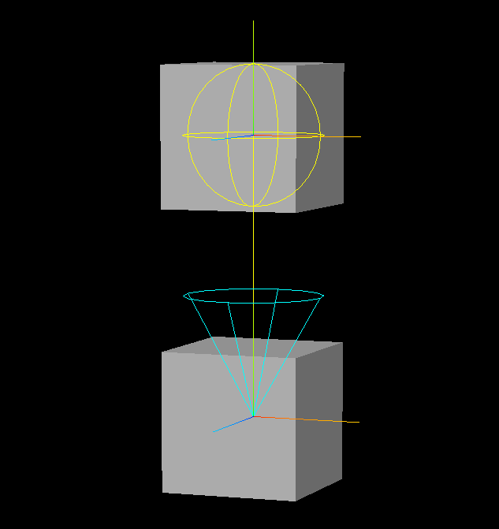
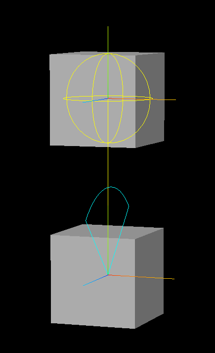
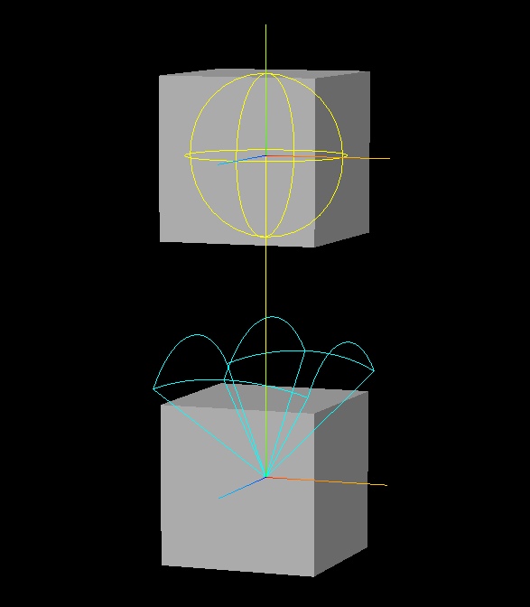
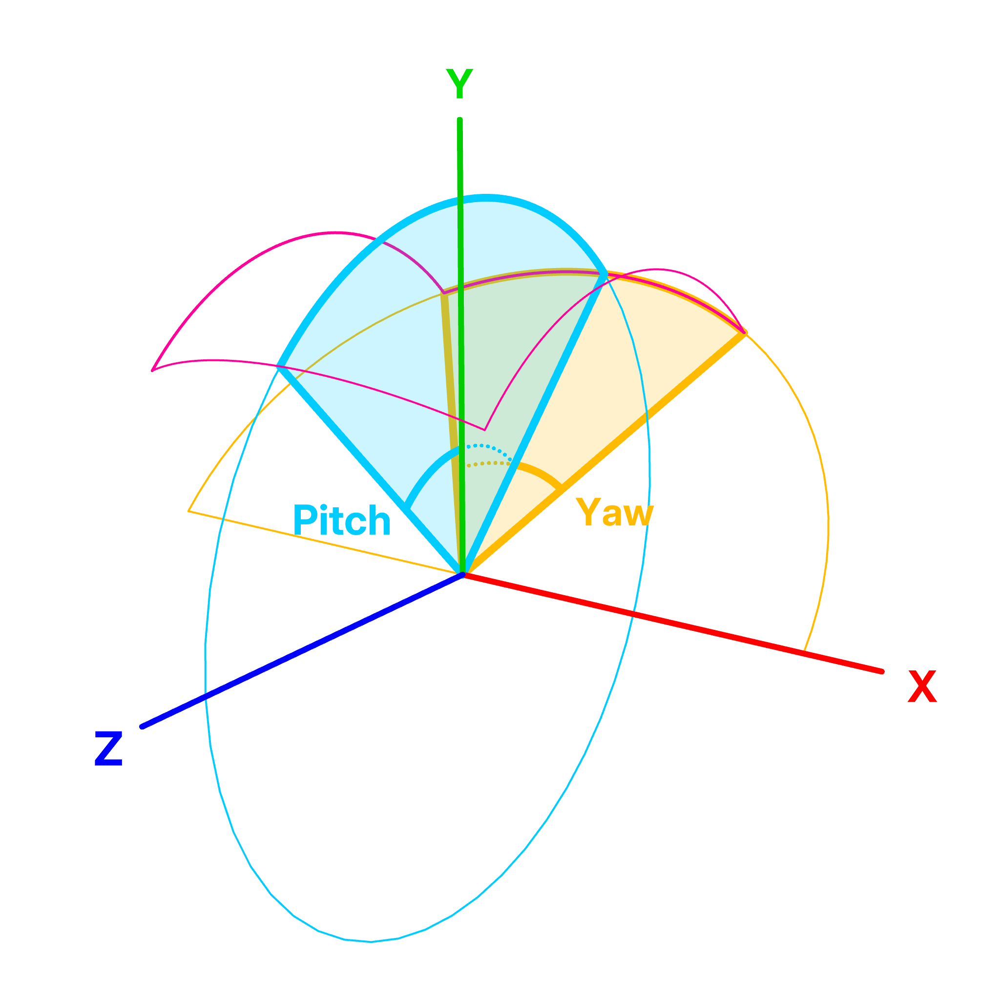
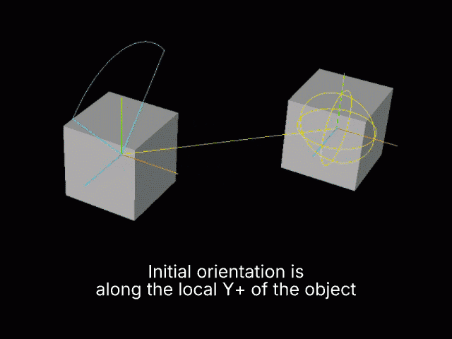

# VRMC_springBone_limit-1.0

*Version 1.0*

<!-- START doctoc generated TOC please keep comment here to allow auto update -->
<!-- DON'T EDIT THIS SECTION, INSTEAD RE-RUN doctoc TO UPDATE -->

- [Contributors](#contributors)
- [Status](#status)
- [Dependencies](#dependencies)
- [Overview](#overview)
  - [Limits](#limits)
    - [Cone Limit](#cone-limit)
    - [Hinge Limit](#hinge-limit)
    - [Spherical Limit](#spherical-limit)
    - [Singular Directions](#singular-directions)
  - [Rotation](#rotation)
  - [Limit Application Order](#limit-application-order)
- [glTF Schema Updates](#gltf-schema-updates)
  - [Extending Springs](#extending-springs)
  - [VRMC_springBone_limit](#vrmc_springbone_limit)
    - [Properties](#properties)
    - [JSON Schema](#json-schema)
    - [VRMC_springBone_limit.specVersion ✅](#vrmc_springbone_limitspecversion-)
    - [VRMC_springBone_limit.limit ✅](#vrmc_springbone_limitlimit-)
  - [Limit](#limit)
    - [Properties](#properties-1)
    - [JSON Schema](#json-schema-1)
    - [Limit.cone](#limitcone)
    - [Limit.hinge](#limithinge)
    - [Limit.spherical](#limitspherical)
  - [ConeLimit](#conelimit)
    - [Properties](#properties-2)
    - [JSON Schema](#json-schema-2)
    - [ConeLimit.angle ✅](#conelimitangle-)
    - [ConeLimit.rotation](#conelimitrotation)
  - [HingeLimit](#hingelimit)
    - [Properties](#properties-3)
    - [JSON Schema](#json-schema-3)
    - [HingeLimit.angle ✅](#hingelimitangle-)
    - [HingeLimit.rotation](#hingelimitrotation)
  - [SphericalLimit](#sphericallimit)
    - [Properties](#properties-4)
    - [JSON Schema](#json-schema-4)
    - [SphericalLimit.pitch ✅](#sphericallimitpitch-)
    - [SphericalLimit.yaw ✅](#sphericallimityaw-)
    - [SphericalLimit.rotation](#sphericallimitrotation)
- [Appendix: Reference Implementations](#appendix-reference-implementations)
  - [Overview](#overview-1)
  - [Rotation](#rotation-1)
  - [ConeLimit](#conelimit-1)
  - [HingeLimit](#hingelimit-1)
  - [SphericalLimit](#sphericallimit-1)

<!-- END doctoc generated TOC please keep comment here to allow auto update -->

## Contributors

- 0b5vr

## Status

Complete

## Dependencies

glTF 2.0仕様に向けて策定されています。

本仕様は [`VRMC_springBone`](https://github.com/vrm-c/vrm-specification/blob/master/specification/VRMC_springBone-1.0/README.ja.md) に依存します。

## Overview

`VRMC_springBone_limit` は、`VRMC_springBone` によって制御されるスプリングの移動範囲を制限するglTF拡張です。
本拡張は、コーンリミット・ヒンジリミット・球面リミットを定義します。

### Limits

本拡張によって定義されるリミットは、コーンリミット・ヒンジリミット・球面リミットの3種類です。

各リミットについて、参考実装を[Appendix: Reference Implementations](#appendix-reference-implementations)に示します。

#### Cone Limit

コーンリミットは、スプリングの移動範囲をコーン状に制限します。

コーンリミットは、コーンの広がりを表す角度・コーンの向きを表す回転で定義されます。

コーンリミットが定義されたスプリングは、HeadからTailに向かう方向を基準として、コーンの角度として指定した角度よりも傾くことがないように回転が制限されます。

リミットのローカル座標系では、コーンはy軸正方向に開きます。



#### Hinge Limit

ヒンジリミットは、スプリングの移動範囲をヒンジ状に制限します。

ヒンジリミットは、ヒンジの広がりを表す角度・ヒンジの向きを表す回転で定義されます。

ヒンジリミットが定義されたスプリングは、HeadからTailに向かう方向を基準として、ヒンジの角度として指定した角度よりも傾くことがないよう、またヒンジが定義した回転軸以外で回転することがないように回転が制限されます。

リミットのローカル座標系では、ヒンジはy軸正方向に開き、x軸周りの回転を許容します。



#### Spherical Limit

球面リミットは、スプリングの移動範囲を球面状に制限します。

球面リミットは、2つの角度Pitch・Yawと、球面の向きを表す回転で定義されます。

球面リミットが定義されたスプリングは、HeadからTailに向かう方向を基準として、パラメータとして設定したPitch・Yawよりも傾くことがないように回転が制限されます。

リミットのローカル座標系では、y軸正方向を基準として、x軸周りの回転をPitch、z軸周りの回転をYawとします。



以下に、球面リミットで指定する2つの角度であるPitch・Yawの図を示します。



#### Singular Directions

Tailの方向から制限後の方向が一意に定まらない場合、実装はリミットのローカル座標系において、次の表に示す方向を選択しなければいけません (**MUST**) 。

|リミット|Tailの方向|制限後の方向|
|:-|:-|:-|
|コーン|y軸負方向|z軸正方向側の境界|
|ヒンジ|x軸正方向または負方向|y軸正方向|
|ヒンジ|y軸負方向|z軸正方向側の境界|
|球面|x軸正方向または負方向|Y軸正方向側の境界|
|球面|y軸負方向|z軸正方向側の境界|

### Rotation

各リミットの向きは、次の手順で決定します。

まず、オブジェクトのy軸正方向をHeadからTailに向かう方向へ一致させるような最短経路の回転を、各リミット固有のローカル形状に適用します。この状態をデフォルトの向きとします。

HeadからTailに向かう方向がちょうどy軸負方向の場合、最短経路の回転が一意に定まらないため、その場合はX軸周りに180度回転させた状態をデフォルトの向きとするよう実装しなければいけません (**MUST**) 。

> HeadからTailに向かう方向がちょうどy軸負方向もしくはそれに近い場合、実装間での結果が安定しない可能性があります。アーティストは、SpringBone JointにLimitを適用する場合、できるだけy軸負方向に近い方向を避けることを推奨します。

デフォルトの向きを適用後、リミットに `rotation` が指定されている場合、デフォルトの向きによって定まるローカル座標系で指定された回転を適用します。



回転について、詳細な実装を[Appendix: Reference Implementations](#appendix-reference-implementations)に示します。

### Limit Application Order

リミットによる角度制限が有効な場合、以下のすべてのタイミングで適用することが推奨されます（**SHOULD**）。

- 慣性計算の直後
- 各コライダーとの衝突が発生した場合、その直後

> 実装は、ターゲットプラットフォーム・実行時設定・LODなどに応じて、リミットの適用頻度を減らしたり、リミットによる角度制限を無効化したりする場合があります。その場合、実行時に得られる最終的なTailの方向がリミットの範囲内に収まることは保証されません。

## glTF Schema Updates

### Extending Springs

リミットは、 `VRMC_springBone` で定義されたジョイントに `VRMC_springBone_limit` 拡張を追加することで記述されます。

`VRMC_springBone.springs[*].joints` 配列の末尾のジョイントは、 `VRMC_springBone` においてTailとしてのみ使用されるため、実装は末尾のジョイントに記述された本拡張を無視しなければなりません（**MUST**）。
Exporter は、末尾のジョイントに本拡張を出力してはいけません（**MUST NOT**）。

```json
{
  "extensionsUsed": [
    "VRMC_springBone",
    "VRMC_springBone_limit"
  ],
  "extensions": {
    "VRMC_springBone": {
      "specVersion": "1.0",
      "springs": [
        {
          "joints": [
            {
              "node": 0,
              "hitRadius": 0.25,
              "stiffness": 1.0,
              "dragForce": 0.4,
              "extensions": {
                "VRMC_springBone_limit": {
                  "specVersion": "1.0",
                  "limit": {
                    "cone": {
                      "angle": 0.785398,
                      "rotation": [ 0.0, 0.0, 0.0, 1.0 ]
                    }
                  }
                }
              }
            },
            // ...
          ]
        },
        // ...
      ],
      // ...
    }
  },
  // 通常のglTF 2.0の情報
  "nodes": [
    // ...
  ]
}
```

### VRMC_springBone_limit

本拡張のルートオブジェクトです。

#### Properties

||型|説明|必須|
|:-|:-|:-|:-|
|`specVersion`|`string`|この拡張のバージョン|✅ Yes|
|`limit`|[Limit](#limit)|リミットの定義|✅ Yes|

#### JSON Schema

[VRMC_springBone_limit.schema.json](schema/VRMC_springBone_limit.schema.json)

#### VRMC_springBone_limit.specVersion ✅

`VRMC_springBone_limit` 拡張のバージョンを示します。値は `"1.0"` でなければなりません（**MUST**）。

- 型: `string`
- 必須: Yes

#### VRMC_springBone_limit.limit ✅

スプリングに適用するリミットを定義します。

- 型: [Limit](#limit)
- 必須: Yes

### Limit

スプリングに適用するリミットを定義します。

`cone` ・ `hinge` ・ `spherical` のうち、いずれか一つのみを含む必要があります（**MUST**）。

#### Properties

||型|説明|必須|
|:-|:-|:-|:-|
|`cone`|[ConeLimit](#conelimit)|コーンリミット|No|
|`hinge`|[HingeLimit](#hingelimit)|ヒンジリミット|No|
|`spherical`|[SphericalLimit](#sphericallimit)|球面リミット|No|

#### JSON Schema

[VRMC_springBone_limit.limit.schema.json](schema/VRMC_springBone_limit.limit.schema.json)

#### Limit.cone

コーンリミットを定義します。

- 型: [ConeLimit](#conelimit)
- 必須: No

#### Limit.hinge

ヒンジリミットを定義します。

- 型: [HingeLimit](#hingelimit)
- 必須: No

#### Limit.spherical

球面リミットを定義します。

- 型: [SphericalLimit](#sphericallimit)
- 必須: No

### ConeLimit

コーンリミットを定義します。

#### Properties

||型|説明|必須|
|:-|:-|:-|:-|
|`angle`|`number`|コーンリミットの角度（弧度法）|✅ Yes|
|`rotation`|`number[4]`|コーンリミットの相対回転|No|

#### JSON Schema

[VRMC_springBone_limit.coneLimit.schema.json](schema/VRMC_springBone_limit.coneLimit.schema.json)

#### ConeLimit.angle ✅

コーンリミットの角度を示します。角度は弧度法で表され、0以上でなければなりません（**MUST**）。
角度がπ以上に設定されている場合、実装は角度をπとして解釈しなければなりません（**MUST**）。
角度をπに設定したとき、コーンの形状は球と同等になります。

- 型: `number`
- 必須: Yes

#### ConeLimit.rotation

コーンリミットのデフォルトの向きからの相対回転を示します。
回転はクォータニオン（x, y, z, w）で表され、wがスカラー成分です。
クォータニオンは単位クォータニオンで表さなければなりません（**MUST**）。

- 型: `number[4]`
- 必須: No
- デフォルト: `[ 0.0, 0.0, 0.0, 1.0 ]`

### HingeLimit

ヒンジリミットを定義します。

#### Properties

||型|説明|必須|
|:-|:-|:-|:-|
|`angle`|`number`|ヒンジリミットの角度（弧度法）|✅ Yes|
|`rotation`|`number[4]`|ヒンジリミットの相対回転|No|

#### JSON Schema

[VRMC_springBone_limit.hingeLimit.schema.json](schema/VRMC_springBone_limit.hingeLimit.schema.json)

#### HingeLimit.angle ✅

ヒンジリミットの角度を示します。角度は弧度法で表され、0以上でなければなりません（**MUST**）。
角度がπ以上に設定されている場合、実装は角度をπとして解釈しなければなりません（**MUST**）。
角度をπに設定したとき、ヒンジの形状は円盤と同等になります。

- 型: `number`
- 必須: Yes

#### HingeLimit.rotation

ヒンジリミットのデフォルトの向きからの相対回転を示します。
回転はクォータニオン（x, y, z, w）で表され、wがスカラー成分です。
クォータニオンは単位クォータニオンで表さなければなりません（**MUST**）。

- 型: `number[4]`
- 必須: No
- デフォルト: `[ 0.0, 0.0, 0.0, 1.0 ]`

### SphericalLimit

球面リミットを定義します。

#### Properties

||型|説明|必須|
|:-|:-|:-|:-|
|`pitch`|`number`|球面リミットのPitch（弧度法）|✅ Yes|
|`yaw`|`number`|球面リミットのYaw（弧度法）|✅ Yes|
|`rotation`|`number[4]`|球面リミットの相対回転|No|

#### JSON Schema

[VRMC_springBone_limit.sphericalLimit.schema.json](schema/VRMC_springBone_limit.sphericalLimit.schema.json)

#### SphericalLimit.pitch ✅

球面リミットのPitch角度を示します。角度は弧度法で表され、0以上でなければなりません（**MUST**）。
角度がπ以上に設定されている場合、実装は角度をπとして解釈しなければなりません（**MUST**）。

- 型: `number`
- 必須: Yes

#### SphericalLimit.yaw ✅

球面リミットのYaw角度を示します。角度は弧度法で表され、0以上でなければなりません（**MUST**）。
角度がπ/2以上に設定されている場合、実装は角度をπ/2として解釈しなければなりません（**MUST**）。

- 型: `number`
- 必須: Yes

#### SphericalLimit.rotation

球面リミットのデフォルトの向きからの相対回転を示します。
回転はクォータニオン（x, y, z, w）で表され、wがスカラー成分です。
クォータニオンは単位クォータニオンで表さなければなりません（**MUST**）。

- 型: `number[4]`
- 必須: No
- デフォルト: `[ 0.0, 0.0, 0.0, 1.0 ]`

## Appendix: Reference Implementations

> *このセクションはNon-normativeです。*

以下に、本拡張で定義する各リミットの参考実装を示します。
`VRMC_springBone` 仕様内のリファレンス実装もあわせて参照してください。

### Overview

[Limit Application Order](#limit-application-order) でも示した通り、リミットによる角度制限は、以下のすべてのタイミングで適用することが推奨されます。

- 慣性計算の直後
- 各コライダーとの衝突が発生した場合、その直後

リミットによる角度制限は、`nextTail` に適用します。
`nextTail` は、SpringBoneの更新中における、そのJointが対象とする子Nodeの暫定的なワールド空間上の位置を表します。
慣性計算の直後、および各コライダーとの衝突を解決した直後に、Jointの位置から `nextTail` に向かう方向が指定された角度範囲に収まるよう、リミットを適用します。
同じタイミングで、スプリングの長さを維持するため、Jointの位置から `nextTail` までの距離を制限します。

以下の参考実装内において登場する `tailDir` は、制限対象のJointから `nextTail` に向かう、ワールド空間上の正規化されたベクトルです。
以下の擬似コードのように定義します。

```ts
var tailDir = (nextTail - joint.worldPosition).normalized;
```

> 以下の擬似コードでは、説明を簡潔にするため浮動小数点誤差を考慮していません。
> 実装では、使用する数値型の精度に応じて、特異方向の判定に許容誤差を用いたり、中間値を演算 (acos, asinなど) の定義域に収めたりするなど、必要な数値誤差対策を行うことを推奨します。

### Rotation

以下に、各リミットをHeadからTailに向かう方向ならびに `rotation` プロパティを利用して回転させる参考実装を擬似コードで示します。
`boneAxis` は、計算するJointが対象とする子Nodeの、ローカル空間におけるレスト状態の伸びる方向を表します。

```ts
// Y+方向からjointのheadからtailに向かうベクトルへの最小回転
let axisRotation;

// headからtailに向かうベクトルとY+方向との内積
let dot = boneAxis.y;

if (dot == -1.0) {
  // headからtailに向かうベクトルがY-方向の場合、X軸周りに180度回転させた回転を設定する
  axisRotation = Quaternion(1, 0, 0, 0);
} else {
  // それ以外の場合、Y+方向からjointのheadからtailに向かうベクトルへの最小回転を設定する
  // quaternion(cross(from, to); dot(from, to) + 1).normalized
  axisRotation = Quaternion(boneAxis.z, 0, -boneAxis.x, dot + 1).normalized;
}

// limitのローカル空間をワールド空間に写像する回転
let rotation = joint.parent.worldRotation * joint.localSpaceInitialRotation * axisRotation * joint.limit.rotation;

// tailの向きをlimitのローカル空間に写像する
tailDir = tailDir.applyQuaternion(rotation.inverse);

// limitを適用する
joint.limit.apply(tailDir);

// tailの向きをワールド空間に戻す
tailDir = tailDir.applyQuaternion(rotation);
```

### ConeLimit

以下は、擬似コードによるコーンリミットの参考実装です。

```ts
// angleを0以上π以下に制限する
let limitAngle = clamp(limit.angle, 0.0, PI);

// tailDirのy要素をlimitに設定されたangleの余弦と比較する
let cosLimitAngle = cos(limitAngle);
if (tailDir.y < cosLimitAngle) {
  // x・z成分からなるベクトルの長さが、limitに設定されたangleの正弦と等しくなるようにスケールする
  let horizontalLengthSquared = 1.0 - tailDir.y * tailDir.y;

  if (horizontalLengthSquared == 0.0) {
    // tailDirがy軸負方向の場合、z軸正方向側を選択する
    tailDir.x = 0.0;
    tailDir.z = sqrt(1.0 - cosLimitAngle * cosLimitAngle);
  } else {
    let scale = sqrt((1.0 - cosLimitAngle * cosLimitAngle) / horizontalLengthSquared);
    tailDir.x *= scale;
    tailDir.z *= scale;
  }

  // y要素をlimitに設定されたangleの余弦とする
  tailDir.y = cosLimitAngle;
}
```

### HingeLimit

以下は、擬似コードによるヒンジリミットの参考実装です。

```ts
// angleを0以上π以下に制限する
let limitAngle = clamp(limit.angle, 0.0, PI);

let projectedLengthSquared = tailDir.y * tailDir.y + tailDir.z * tailDir.z;
if (projectedLengthSquared == 0.0) {
  // tailDirがx軸正方向または負方向の場合、Y軸正方向を選択する
  tailDir = vec3(0.0, 1.0, 0.0);
} else {
  // tailDirをヒンジのYZ平面へ射影する
  tailDir = vec3(0.0, tailDir.y, tailDir.z) / sqrt(projectedLengthSquared);

  // tailDirのy要素をlimitに設定されたangleの余弦と比較する
  let cosLimitAngle = cos(limitAngle);
  if (tailDir.y < cosLimitAngle) {
    let sinLimitAngle = sqrt(1.0 - cosLimitAngle * cosLimitAngle);

    // tailDirがy軸負方向の場合、z軸正方向側を選択する
    let zSign = (tailDir.z < 0.0) ? -1.0 : 1.0;
    tailDir.y = cosLimitAngle;
    tailDir.z = sinLimitAngle * zSign;
  }
}
```

### SphericalLimit

以下は、擬似コードによる球面リミットの参考実装です。

```ts
// pitchを0以上π以下、yawを0以上π/2以下に制限する
let limitPitch = clamp(limit.pitch, 0.0, PI);
let limitYaw = clamp(limit.yaw, 0.0, PI / 2.0);

// tailDirのpitch・yawを計算する
var pitch;
if (tailDir.y == -1.0) {
  // tailDirがy軸負方向の場合、Z軸正方向側の境界を選択するため、pitchをπとする
  pitch = PI;
} else if (abs(tailDir.x) == 1.0) {
  // tailDirがx軸正方向または負方向の場合、pitchを0とする
  pitch = 0.0;
} else {
  pitch = atan2(tailDir.z, tailDir.y);
}
var yaw = asin(tailDir.x);

// pitchをlimitに設定されたpitchを用いて制限する
if (abs(pitch) > limitPitch) {
  isLimited = true;
  pitch = limitPitch * sign(pitch);
}

// yawをlimitに設定されたyawを用いて制限する
if (abs(yaw) > limitYaw) {
  isLimited = true;
  yaw = limitYaw * sign(yaw);
}

// tailDirをpitch・yawを用いて再計算する
tailDir = vec3(
  sin(yaw),
  cos(yaw) * cos(pitch),
  cos(yaw) * sin(pitch)
);
```
